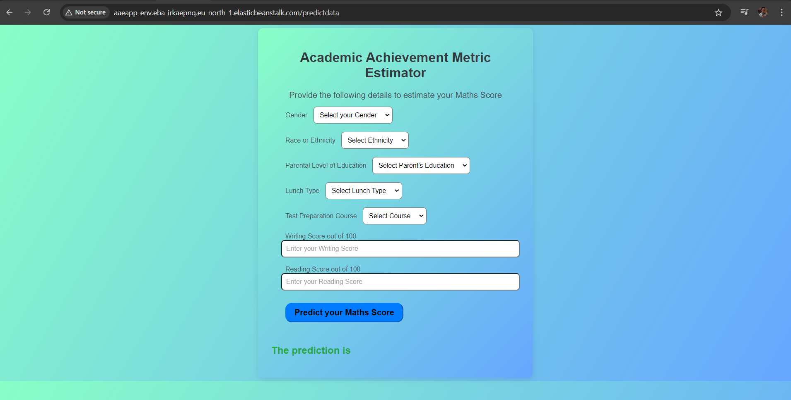
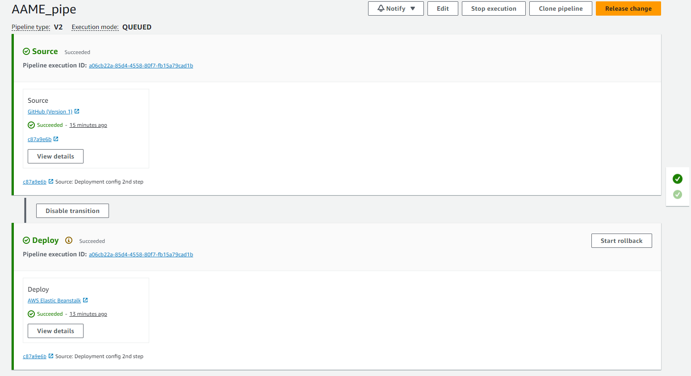

# Academic Achievement Metric Estimator

This project predicts student math scores based on various factors such as gender, race/ethnicity, parental education, and other features. The project is built using Python, Flask, and machine learning models. It provides a web interface for users to input student data and receive predicted scores for their math exams.

The project is deployed using **AWS Elastic Beanstalk** with **Continuous Integration (CI)** and **Continuous Deployment (CD)** pipelines configured using **GitHub Actions**.

## Table of Contents

- [Installation](#installation)
- [Usage](#usage)
- [Modeling Process](#modeling-process)
- [Deployment](#deployment)
- [Technologies Used](#technologies-used)
- [License](#license)

## Installation


### Prerequisites and Local Run Steps

1. Clone the repository:

   ```bash
   git clone https://github.com/Gouranga-GH/ETEP-ModularCoding-GitHubActions-AWS.git
   cd ETEP-ModularCoding-GitHubActions-AWS
   ```

2. If you're developing locally, create a virtual environment:

   ```bash
   python3 -m venv venv
   source venv/bin/activate   # On Windows, use `venv\Scripts\activate`


3. Install the required Python packages:

   ```bash
   pip install -r requirements.txt
   ```


   ```

4. To run the Flask app locally, use the following command:

   ```bash
   python application.py
   ```

5. Access the web app at `http://127.0.0.1:5000/` in your browser.


## Usage

### Web Application

1. Run the Flask server locally:

   ```bash
   python application.py
   ```

2. Open the app in your browser at `http://127.0.0.1:5000/`.

3. Enter the required details on the prediction page, such as gender, race, parental education, etc., and click "Predict your Maths Score."

4. The app will display the predicted math score based on the input data.


## Modeling Process

1. **Data Ingestion**: The data is ingested from a CSV file (`stud.csv`) and split into training and test sets using `train_test_split`.

2. **Data Transformation**: Numerical and categorical features are preprocessed using pipelines defined in `data_transformation.py`. Imputation, one-hot encoding, and scaling are applied as needed.

3. **Model Training**: Various models like Random Forest, Decision Tree, and CatBoost are trained using hyperparameter tuning through `GridSearchCV`. The best model is selected based on performance.

4. **Prediction**: The trained model is saved as a pickle file, and predictions are made using new input data through a web interface or directly via the pipeline.

## Deployment

### AWS Elastic Beanstalk

The project is deployed to **AWS Elastic Beanstalk**, which provides an easy-to-use cloud service for deploying and managing applications. The configuration for Elastic Beanstalk is located in the `.ebextensions/` directory.

The application will be accessible via the AWS Elastic Beanstalk URL provided after deployment.

### Continuous Integration & Deployment with GitHub Actions

This project uses **GitHub Actions** to automate testing, building, and deployment processes. The CI/CD pipeline is configured in the `.github/workflows/` directory.

- **CI Pipeline**: Automatically runs tests, lints code, and builds the project upon every pull request or push to the `main` branch.
  
- **CD Pipeline**: Once the CI pipeline passes, the project is automatically deployed to AWS Elastic Beanstalk.


## Technologies Used

- **Flask**: Web framework for the application.
- **Pandas, NumPy**: Data manipulation and analysis.
- **scikit-learn**: Machine learning model training and evaluation.
- **XGBoost, CatBoost**: Advanced gradient boosting models.
- **Jupyter Notebooks**: For EDA and model training.
- **AWS Elastic Beanstalk**: Cloud platform for deploying the application.
- **GitHub Actions**: CI/CD automation tool for testing and deployment.

## App Images







## License

This project is licensed under the MIT License. See the [LICENSE](LICENSE) file for more details.
